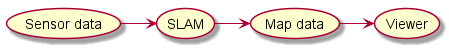
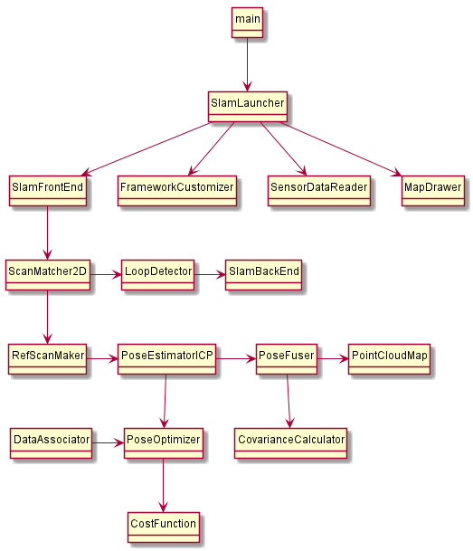

# SLAMDesignUML
Plant UML diagrams of basic SLAM software.  

## Table of contents

* [About this repository](#about-this-repository)
* [Reference](#reference)
* [Overview of system](#overview-of-system)
* [Program composition](#program-composition)
* [Author](#author)

## About this repository

This repository is a Plant UML diagrams collection of SLAM programs.  
All of diagrams is designed as C++ code. The purpose of this repository  
is to study the design and algorithm of SLAM.  

## Reference

All of diagrams is drawn based on [SLAM入門](https://www.amazon.co.jp/SLAM%E5%85%A5%E9%96%80-%E3%83%AD%E3%83%9C%E3%83%83%E3%83%88%E3%81%AE%E8%87%AA%E5%B7%B1%E4%BD%8D%E7%BD%AE%E6%8E%A8%E5%AE%9A%E3%81%A8%E5%9C%B0%E5%9B%B3%E6%A7%8B%E7%AF%89%E3%81%AE%E6%8A%80%E8%A1%93-%E5%8F%8B%E7%B4%8D-%E6%AD%A3%E8%A3%95/dp/4274221660/ref=sr_1_1?__mk_ja_JP=%E3%82%AB%E3%82%BF%E3%82%AB%E3%83%8A&crid=18ZYA7OX3FQIR&dchild=1&keywords=slam%E5%85%A5%E9%96%80&qid=1588648035&sprefix=slam%2Caps%2C1355&sr=8-1).  
This book introduces a technology of localization and mapping by SLAM  
and a sample code of them. They are written in C++.    
I refer to those programs and drew a UML diagram of them.  

## Overview of system

This system is 2D-SLAM with LiDAR.  
Every time the sensing data from LiDAR is input,  
this system execute SLAM and output a map data as follow.  

Each node has a the following content.  

|Node|Content|
|----|-------|
|Sensor data|Scan data, Odometry|
|SLAM|Scan Matching, Sensor Fusion, Loop Closure|
|Map data|2D Point Cloud, Robot trajectory|
|Viewer|Animation|

## Program composition

* Main components

|Program name|Content|
|------------|-------|
|main|Main function|
|SlamLauncher|To launch SLAM|
|SensorDataReader|To read sensor data|
|MapDrawer|Helper to draw by gnuplot|
|FrameworkCustomizer|Helper to cutomize program|
|SlamFrontEnd|Frontend process of SLAM|
|[SlamBackEnd](https://github.com/ShisatoYano/SLAMDesignUML/tree/master/PlantUML/SlamBackEnd)|Backend process of SLAM|
|[LoopDetector](https://github.com/ShisatoYano/SLAMDesignUML/tree/master/PlantUML/LoopDetector)|To detect loop|
|ScanMatcher2D|To supervise Scan matching|
|[RefScanMaker](https://github.com/ShisatoYano/SLAMDesignUML/tree/master/PlantUML/RefScanMaker)|To generate reference scan|
|[PoseEstimatorICP](https://github.com/ShisatoYano/SLAMDesignUML/tree/master/PlantUML/PoseEstimatorICP)|To calculate robot position by ICP|
|[DataAssociator](https://github.com/ShisatoYano/SLAMDesignUML/tree/master/PlantUML/DataAssociator)|To associate data|
|[PoseOptimizer](https://github.com/ShisatoYano/SLAMDesignUML/tree/master/PlantUML/PoseOptimizer)|To minimize cost function|
|[CostFunction](https://github.com/ShisatoYano/SLAMDesignUML/tree/master/PlantUML/CostFunction)|Cost function|
|[PointCloudMap](https://github.com/ShisatoYano/SLAMDesignUML/tree/master/PlantUML/PointCloudMap)|To manage point cloud map|
|ScanPointResampler|To equalize space between scan point|
|ScanPointAnalyzer|To calculate normal vector of scan point|
|[CovarianceCalculator](https://github.com/ShisatoYano/SLAMDesignUML/tree/master/PlantUML/CovarianceCalculator)|To calculate covariance|
|[PoseFuser](https://github.com/ShisatoYano/SLAMDesignUML/tree/master/PlantUML/PoseFuser)|Sensor fusion|

* Utility and class definition

|Program name|Content|
|------------|-------|
|[MyUtil](https://github.com/ShisatoYano/SLAMDesignUML/tree/master/PlantUML/MyUtil)|Basic type and utility function|
|[Pose2D](https://github.com/ShisatoYano/SLAMDesignUML/tree/master/PlantUML/Pose2D)|Class definition of robot position|
|[LPoint2D](https://github.com/ShisatoYano/SLAMDesignUML/tree/master/PlantUML/LPoint2D)|Class definition of scan point|
|[Scan2D](https://github.com/ShisatoYano/SLAMDesignUML/tree/master/PlantUML/Scan2D)|Class definition of scan|
|[NNGridTable](https://github.com/ShisatoYano/SLAMDesignUML/tree/master/PlantUML/NNGridTable)|Data association table|
|[PoseGraph](https://github.com/ShisatoYano/SLAMDesignUML/tree/master/PlantUML/PoseGraph)|Class definition of pose graph|
|[P2oDriver2D](https://github.com/ShisatoYano/SLAMDesignUML/tree/master/PlantUML/P2oDriver2D)|To launch pose adjustment|

* Customized class by derivation

|Program name|Content|
|------------|-------|
|[RefScanMakerBS](https://github.com/ShisatoYano/SLAMDesignUML/tree/master/PlantUML/RefScanMaker/RefScanMakerBS)|To refer just before scan|
|[RefScanMakerLM](https://github.com/ShisatoYano/SLAMDesignUML/tree/master/PlantUML/RefScanMaker/RefScanMakerLM)|To refer local map data|
|[CostFunctionED](https://github.com/ShisatoYano/SLAMDesignUML/tree/master/PlantUML/CostFunction/CostFunctionED)|Euclid distance is used as cost function|
|[CostFunctionPD](https://github.com/ShisatoYano/SLAMDesignUML/tree/master/PlantUML/CostFunction/CostFunctionPD)|Perpendicular distance is used as cost function|
|[PoseOptimizerSD](https://github.com/ShisatoYano/SLAMDesignUML/tree/master/PlantUML/PoseOptimizer/PoseOptimizerSD)|Optimization by Steepest descent|
|[PoseOptimizerSL](https://github.com/ShisatoYano/SLAMDesignUML/tree/master/PlantUML/PoseOptimizer/PoseOptimizerSL)|Optimization by Steepest descent and Line search|
|[DataAssociatorLS](https://github.com/ShisatoYano/SLAMDesignUML/tree/master/PlantUML/DataAssociator/DataAssociatorLS)|Data association by Linear search|
|[DataAssociatorGT](https://github.com/ShisatoYano/SLAMDesignUML/tree/master/PlantUML/DataAssociator/DataAssociatorGT)|Data association by Grid table|
|[PointCloudMapBS](https://github.com/ShisatoYano/SLAMDesignUML/tree/master/PlantUML/PointCloudMap/PointCloudMapBS)|Point cloud map management by saving all of scan points|
|[PointCloudMapGT](https://github.com/ShisatoYano/SLAMDesignUML/tree/master/PlantUML/PointCloudMap/PointCloudMapGT)|Point cloud map management by Grid table|
|[PointCloudMapLP](https://github.com/ShisatoYano/SLAMDesignUML/tree/master/PlantUML/PointCloudMap/PointCloudMapLP)|Partial map management by Grid table|
|[LoopDetectorSS](https://github.com/ShisatoYano/SLAMDesignUML/tree/master/PlantUML/LoopDetector/LoopDetectorSS)|To detect loop by partial map|

* Vertical arrow means a function is called.
* Horizontal arrow means a process sequence.

## Author

* [Shisato Yano](https://github.com/ShisatoYano)